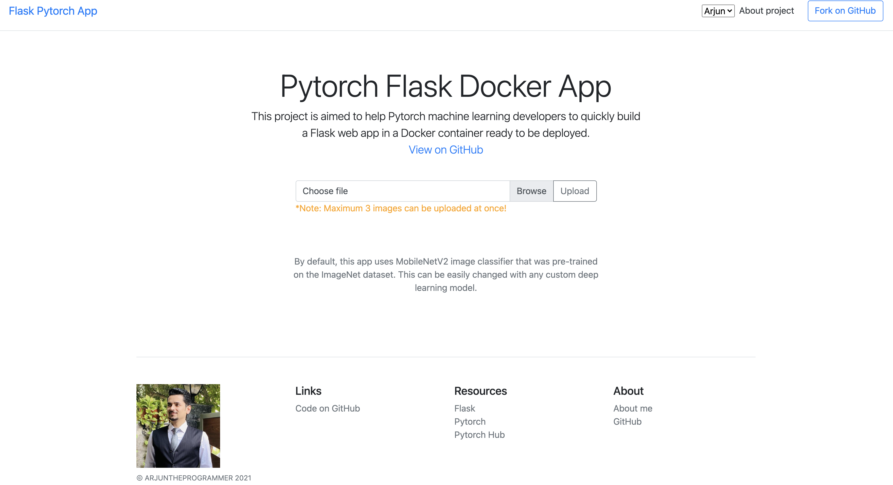

# TSAI - Session 3

Containerization

## ASSIGNMENT

1. Look at this startup app
   - <https://github.com/imadtoubal/Pytorch-Flask-Starter>
2. Edit UI such that it shows your name. You will be using this in the future as well.
3. Change the application such that user can upload 3 images simultaneously, and upload them using single upload button and then see the results.
4. Show the uploaded image on the final page when you show the results as well.
5. Show the classification name, confidence level of the last 5 images uploaded.
6. In the Dockerfile make changes such that it used entrypoint to load a sample image from your docker image ans show results on the landing page.
7. Add a dropdown menu to your title bar to allow user to select this app, or see a page listing you/your-team name.
8. Upload a Heroku and share the link.

---

This website is deployed in Heroku: <https://pytorch-flask-mobilenet.herokuapp.com/>

By default, this app uses MobileNetV2 image classifier that was pre-trained on the ImageNet dataset. This can be easily changed with any custom deep learning model.

## Getting Started (using Python virtualenv)

You need to have Python installed in your computer.

1. Install `virtualenv`:

   pip install virtualenv

2. Create a Python virtual environment:

   virtualenv venv

3. Activate virtual environment:

   1. Windows:

      cd venv\Scripts
      activate
      cd ..\..

   2. Linux / Mac:

      source venv/bin/activate

4. Install libraries:

   pip install -r requirements.txt

### Run the code

- Run the app:

  flask run

- Run on a specific port:

  flask run -p <port>

## Getting Started (using Docker)

1. Create a Docker image

   docker build -t pytorchflask .

   This will create an image with the name `pytorchflask`. You can replace that with a custom name for your app.

2. Run the docker image

   docker run -d -p 127.0.0.1:5000:80 pytorchflask

   This will run the app on port `5000`. You can replace that with which ever port that is more suitable.

## Deploying to Heroku

- Create Heroku app

  heroku create
  git push heroku master

OR

- Add to existing Heroku app

  heroku git:remote -a <your-app-name>
  git push heroku master

## Changing the model

1. Go to `models.py`
2. Follow the structure of the class `MobileNet`to create a custom model class
3. Use your class in `app.py`

## Built With

- [Pytorch](https://pytorch.org/) - The Machine Learning framework used
- [Flask](http://flask.palletsprojects.com/en/1.1.x/) - The web server library

## REFERENCE

1. <https://github.com/imadtoubal/Pytorch-Flask-Starter>
2. <https://kodekloud.com/courses/labs-docker-for-the-absolute-beginner-hands-on/>

---
